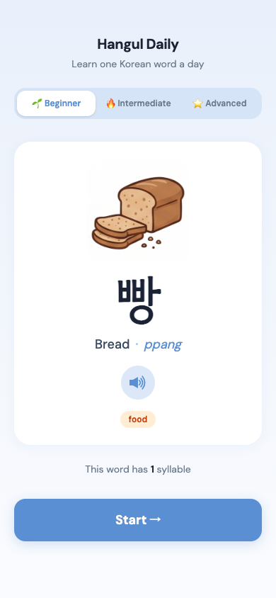
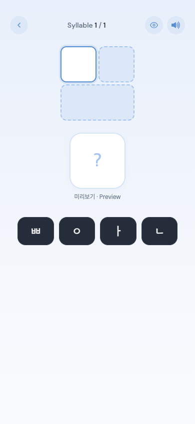
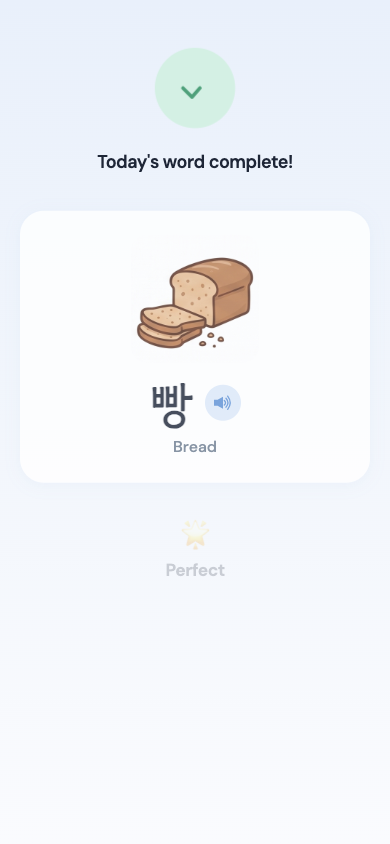

# Hangul Daily

> Learn one Korean word a day — from letters to meaning.

Hangul Daily is a web app for people who have just started learning the Korean language. Because the Korean alphabet, Hangul, works very differently from the Roman alphabet — consonants and vowels combine to form syllable blocks — the app focuses on building that intuition from day one.

Every day the app presents a fresh word. Users learn it, practice building it from its component letters, and then see a breakdown of exactly how the syllable was composed. Done in three steps, every day.

---

## The Three Screens

### 1. Intro — Learn the Word



The first screen is the learning page. It shows:

- The Korean word in large text, with its English meaning and romanisation
- A **photo** of what the word means, to help it stick
- An **audio button** to hear the correct pronunciation
- The **theme** (food, nature, body, etc.) and syllable count

Users choose their level — Beginner, Intermediate, or Advanced — and tap **Start** when ready.

---

### 2. Game — Build the Word



The second screen is the puzzle. Users assemble the word syllable by syllable by selecting the correct jamo (Korean letters) from a tile bank:

- **초성** — the initial consonant (e.g. ㅂ)
- **중성** — the vowel (e.g. ㅏ)
- **종성** — the final consonant, if there is one (e.g. ㅇ)

The number of tiles shown depends on the level — more decoy tiles appear at higher levels to increase difficulty. If users get stuck, a **hint button** in the top corner briefly reveals the full word.

---

### 3. Result — Review the Breakdown



Once the user selects all the correct letters, the result screen appears. It shows:

- A completion message with a **performance rating** (Perfect → Just Starting, based on mistake count)
- The completed word with its image
- A **syllable breakdown** — showing exactly which consonants and vowels combined to form each block, e.g. ㅂ + ㅏ + ㅇ = 방

This acts as a wrap-up and review session, making sure users understand the structure — not just the shape — of the word.

---

## Levels

| Level           | Description       | Tiles shown |
| --------------- | ----------------- | ----------- |
| 🌱 Beginner     | 1-syllable words  | 4 tiles     |
| 🔥 Intermediate | 2-syllable words  | 6 tiles     |
| ⭐ Advanced     | 3+ syllable words | 8 tiles     |

Each level draws from its own word list. Levels differ not just in syllable count, but in the number of decoy tiles — making it harder to guess.

---

## Word Topics

Words are drawn from 13 everyday themes: food, body, nature, home, numbers, education, people, music, emotion, technology, places, animals, and transportation.

---

## Tech Stack

|           |                                         |
| --------- | --------------------------------------- |
| Framework | React 19                                |
| Router    | React Router v7                         |
| Build     | Vite                                    |
| Styling   | Tailwind CSS v4                         |
| Animation | Framer Motion                           |
| Fonts     | Gowun Dodum (Korean), DM Sans (English) |
| Speech    | Web Speech API                          |
| Analytics | Google Tag Manager                      |

---

## Getting Started

```bash
pnpm install
pnpm run dev
```

Open [http://localhost:5173](http://localhost:5173) in your browser.

```bash
pnpm run build    # production build
pnpm run preview  # preview the production build locally
```
